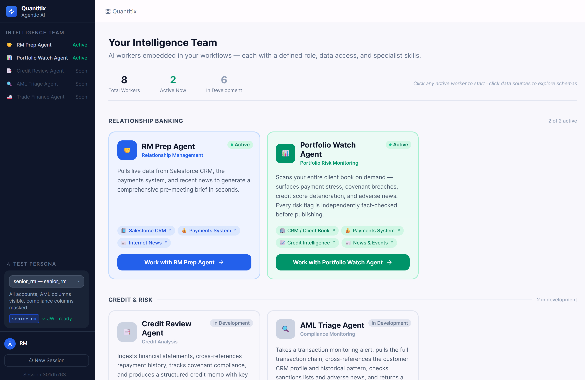

# Meridian Enterprise AI



Meridian is an enterprise agentic AI platform for regulated financial-services workflows. It combines:

- Secure agent services built with LangGraph and FastAPI
- MCP tool servers for CRM, payments, news, and SQL access
- A shared `platform-sdk` for auth, policy enforcement, caching, logging, and telemetry
- A local Docker stack for development, testing, and demos

This repository currently includes:

- `rm-prep-agent`: builds client meeting briefs from CRM, payments, and news
- `portfolio-watch-agent`: scans a book of business and produces a verified risk report
- `ai-agents`: a generic chat agent backed by a secure SQL MCP server
- `agent-ui`: the React frontend for the RM Prep and Portfolio Watch agents
- `chat-ui`: a Chainlit frontend for the generic chat agent

## Contents

- [What This Repo Contains](#what-this-repo-contains)
- [Quick Start](#quick-start)
- [Verify It Works](#verify-it-works)
- [Local Endpoints](#local-endpoints)
- [Common Commands](#common-commands)
- [How It Works](#how-it-works)
- [Testing Strategy](#testing-strategy)
- [Repository Structure](#repository-structure)
- [Further Reading](#further-reading)

## What This Repo Contains

### Main agents

| Service | Purpose | Default local URL |
|---|---|---|
| `rm-prep-agent` | Generates pre-meeting briefs from CRM, payments, and news | `http://localhost:8003` |
| `portfolio-watch-agent` | Produces portfolio monitoring reports with generator/evaluator verification | `http://localhost:8004` |
| `ai-agents` | Generic secure chat agent for SQL-backed workflows | `http://localhost:8000` |

### Main frontends

| Frontend | Purpose | Default local URL |
|---|---|---|
| `agent-ui` | React UI for RM Prep and Portfolio Watch | `http://localhost:3000` |
| `chat-ui` | Chainlit UI for the generic chat agent | `http://localhost:8501` |

### MCP tool servers

| MCP server | Purpose | Default local URL |
|---|---|---|
| `data-mcp` | Secure read-only SQL for the generic agent | `http://localhost:8080` |
| `salesforce-mcp` | CRM account summary and relationship context | `http://localhost:8081` |
| `payments-mcp` | Payment analytics and compliance-aware payment profile | `http://localhost:8082` |
| `news-search-mcp` | Company news via Tavily or mock data | `http://localhost:8083` |

## Quick Start

### Prerequisites

- Docker Desktop
- Python 3.11+
- Make
- OPA CLI

Example install commands:

```bash
# macOS
brew install python@3.11 opa

# Linux / WSL
sudo apt install python3-full make
curl -L -o opa https://github.com/open-policy-agent/opa/releases/download/v0.65.0/opa_linux_amd64_static
chmod +x opa
sudo mv opa /usr/local/bin/opa
```

### 1. Create local config

```bash
cp .env.example .env
```

Fill in at least these values in `.env`:

- `AZURE_API_KEY`
- `AZURE_API_BASE`
- `INTERNAL_API_KEY`
- `JWT_SECRET`
- `CONTEXT_HMAC_SECRET`
- `POSTGRES_PASSWORD`
- `REDIS_PASSWORD`

Generate the secrets with:

```bash
python -c "import secrets; print('sk-ent-' + secrets.token_hex(24))"
python -c "import secrets; print(secrets.token_hex(32))"
python -c "import secrets; print(secrets.token_hex(32))"
```

### 2. Install the shared SDK locally

```bash
make sdk-install
```

This creates `.venv/` and installs `platform-sdk` in editable mode.

### 3. Start the full local stack

```bash
make dev-test-up
```

Use `make dev-test-up` for the recommended local setup. It starts the full stack and seeds:

- `salesforce.*` test CRM schema
- `bankdw.*` test payments schema
- RM Prep persona-testing support

If you only want the generic chat path without CRM and payments fixtures:

```bash
make dev-up
```

### 4. Watch logs if something looks stuck

```bash
make dev-logs
```

## Verify It Works

### Fastest path

1. Open [http://localhost:3000](http://localhost:3000)
2. Select the RM Prep worker
3. Enter a company name such as `Microsoft Corp.` or `Ford Motor Company`
4. Run the workflow
5. Confirm you receive a generated markdown brief

### Portfolio Watch path

1. Open [http://localhost:3000](http://localhost:3000)
2. Select the Portfolio Watch worker
3. Run the default scan
4. Confirm you receive a report plus fact-check status updates

### Generic chat path

1. Open [http://localhost:8501](http://localhost:8501)
2. Sign in with any username in local development
3. Send a prompt that requires SQL-backed reasoning

### Health checks

```bash
curl http://localhost:8000/health
curl http://localhost:8003/health
curl http://localhost:8004/health
```

## Local Endpoints

| Interface | URL | Notes |
|---|---|---|
| Agent UI | `http://localhost:3000` | React UI for RM Prep and Portfolio Watch |
| Chat UI | `http://localhost:8501` | Chainlit UI for the generic chat agent |
| Generic Agent API | `http://localhost:8000` | FastAPI service for `ai-agents` |
| RM Prep Agent API | `http://localhost:8003` | FastAPI service for brief generation |
| Portfolio Watch API | `http://localhost:8004` | FastAPI service for portfolio reports |
| LiteLLM Proxy | `http://localhost:4000` | Shared model routing layer |
| OPA | `http://localhost:8181` | Policy engine |
| Data MCP | `http://localhost:8080` | Generic secure SQL |
| Salesforce MCP | `http://localhost:8081` | CRM MCP server |
| Payments MCP | `http://localhost:8082` | Payments MCP server |
| News MCP | `http://localhost:8083` | News MCP server |
| PostgreSQL | `localhost:5432` | Local development database |

## Common Commands

| Command | What it does |
|---|---|
| `make dev-up` | Start the stack without CRM/payments test fixtures |
| `make dev-test-up` | Start the full stack with seeded CRM and payments data |
| `make dev-down` | Stop all containers |
| `make dev-reset` | Reset the DB volume and restart with test fixtures |
| `make dev-logs` | Follow all container logs |
| `make dev-status` | Show container and health status |
| `make test` | Run fast local checks: unit tests + OPA policy tests |
| `make test-unit` | Run unit tests only |
| `make test-integration` | Run integration tests against the Docker stack |
| `make test-evals` | Run LLM-in-the-loop evals |
| `make test-policies` | Run OPA policy tests only |
| `make lint` | Run Ruff |
| `make format` | Auto-format Python source |
| `make clean` | Remove local Python caches and `.venv` |

## How It Works

### High-level architecture

```text
Browser / API Client
  └─> API Gateway  (Kong · Auth0 JWT · OPA tool_auth)
        └─> Orchestrator Agent  (LangGraph StateGraph / ReAct)
              ├─> Specialist Agent Node: gather_crm
              │     └─> salesforce-mcp  ->  Salesforce CRM
              ├─> Specialist Agent Node: gather_payments
              │     └─> payments-mcp   ->  Payments API
              ├─> Specialist Agent Node: gather_news
              │     └─> news-search-mcp -> News Search API
              └─> Specialist Agent Node: gather_data
                    └─> data-mcp        ->  PostgreSQL (row-filtered, column-masked)

Cross-cutting concerns (applied at every layer)
  └─> platform-sdk   — AgentContext propagation, OPA checks, cache helpers, telemetry
  └─> OPA            — fail-closed policy evaluation (tool_auth.rego · rm_prep_authz.rego)
  └─> Redis          — tool-result cache, rate-limit counters, session state
  └─> OpenTelemetry  — distributed traces and spans → Dynatrace APM
```

Orchestrator agents own the workflow and routing logic. They never call data sources directly — they delegate to specialist nodes, each of which calls a single MCP tool server. MCP servers enforce row-level restrictions, column masking, and audit boundaries before touching any backend.

### Core design ideas

#### 1. Shared platform SDK

The `platform-sdk/` package centralizes cross-cutting behavior so every service uses the same patterns for:

- API key verification
- `AgentContext` creation and propagation
- OPA authorization
- cache helpers
- structured logging
- telemetry
- config loading

This keeps service code focused on business logic instead of repeating infrastructure code.

#### 2. MCP for data access

Each data source is wrapped as an MCP server. Agents do not talk directly to CRM or payments databases. Instead they call MCP tools that enforce:

- tool-level authorization
- row-level restrictions
- column masking
- cache policy
- traceable request boundaries

#### 3. Policy as code with OPA

Authorization is delegated to Open Policy Agent rather than embedded ad hoc in service code. That gives you:

- version-controlled policy
- repeatable tests
- a single place to review authorization logic

#### 4. Different agent patterns for different jobs

All agents follow a two-tier pattern: an **orchestrator** drives the workflow, and **specialist nodes** handle focused data-retrieval tasks. Specialist nodes call MCP tools — they never skip that layer to reach databases or APIs directly.

| Agent | Orchestrator pattern | Specialist nodes | MCP tools called |
|---|---|---|---|
| `ai-agents` | ReAct tool-call loop | Single node per tool call | `data-mcp` |
| `rm-prep-agent` | Deterministic `StateGraph` | `gather_crm`, `gather_payments`, `gather_news` (run in parallel) | `salesforce-mcp`, `payments-mcp`, `news-search-mcp` |
| `portfolio-watch-agent` | Generator / evaluator loop | `gather_data`, `generate_report`, `evaluate_report` | `data-mcp`, `news-search-mcp` |

### RM Prep flow

```text
parse_intent
  -> route
  -> gather_crm
  -> gather_payments
  -> gather_news
  -> synthesize
  -> format_brief
```

Why this matters:

- CRM, payments, and news can run in parallel
- the brief always checks the required domains
- the output shape is predictable

### Security model

Authentication and authorization flow:

1. The API boundary authenticates the caller
2. The agent builds an `AgentContext`
3. That context is signed and forwarded as `X-Agent-Context`
4. MCP servers verify the signature
5. OPA decides whether the tool call is allowed
6. Row filters and column masks are applied before data is returned

This avoids forwarding raw user JWTs to every downstream service.

### Caching model

There are two main cache layers:

- LiteLLM semantic cache for model responses
- tool-result caching for MCP tool outputs

This improves latency and reduces repeated work while keeping security decisions centralized.

## Testing Strategy

The repo uses three layers of testing so failures are easier to understand and debug.

### Layer 1: unit tests

Run with:

```bash
make test-unit
```

Focus:

- auth and HMAC helpers
- row-filter and column-mask logic
- cache-key behavior
- markdown rendering

### Layer 2: integration tests

Run with:

```bash
make dev-test-up
make test-integration
```

Focus:

- API behavior
- OPA policy decisions
- database-backed tool behavior
- seeded local test data

### Layer 3: evals

Run with:

```bash
make test-evals
```

Focus:

- synthesis quality
- specialist tool-calling fidelity
- hallucination and grounding checks

## Repository Structure

```text
enterprise-ai/
├── agents/
│   ├── src/                  # Generic chat agent service
│   ├── rm-prep/              # RM Prep agent
│   └── portfolio-watch/      # Portfolio Watch agent
├── frontends/
│   ├── agent-ui/             # React frontend
│   └── chat-ui/              # Chainlit frontend
├── tools/
│   ├── data-mcp/             # Secure SQL MCP
│   ├── salesforce-mcp/       # CRM MCP
│   ├── payments-mcp/         # Payments MCP
│   ├── news-search-mcp/      # News MCP
│   └── shared/               # Shared MCP auth helpers
├── platform-sdk/             # Shared SDK used by services
├── platform/                 # DB schema, seed data, LiteLLM, OTel config
├── tests/                    # Unit, integration, and eval tests
├── testdata/                 # Synthetic CRM and payments fixtures
├── docker-compose.yml
├── docker-compose.test.yml
└── Makefile
```

## Troubleshooting First Steps

If the stack is not behaving as expected:

```bash
make dev-status
make dev-logs
make dev-reset
```

Useful checks:

- Confirm `.env` exists and required secrets are populated
- Confirm Docker containers are healthy
- Confirm LiteLLM can reach your model provider
- Confirm the database was seeded if you expect CRM/payments test data

For deeper troubleshooting, see [TROUBLESHOOTING.md](TROUBLESHOOTING.md).

## Further Reading

- [DEVELOPER_GUIDE.md](DEVELOPER_GUIDE.md) for adding new agents and MCP servers
- [RM_PREP_AGENT_ARCHITECTURE.md](RM_PREP_AGENT_ARCHITECTURE.md) for RM Prep design details
- [TROUBLESHOOTING.md](TROUBLESHOOTING.md) for common issues and recovery steps
- [`docs/`](docs/) for additional architecture and design notes
